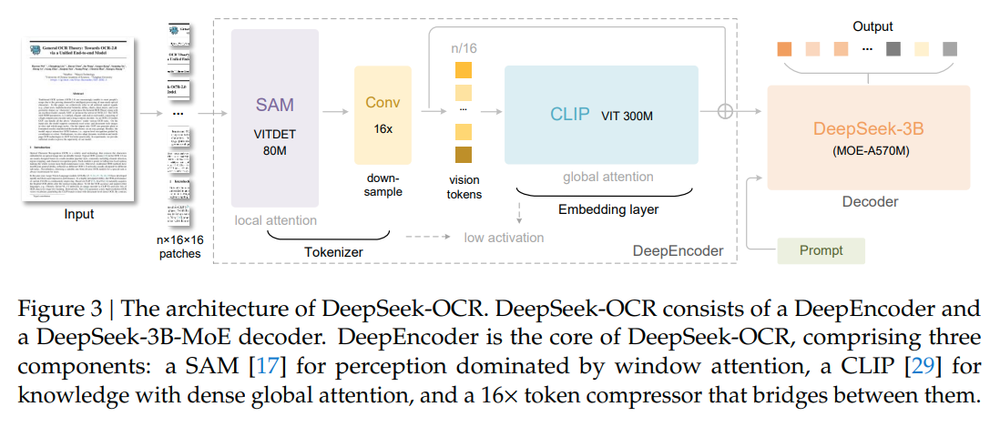
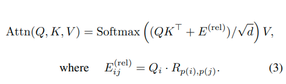

# DeepSeek-OCR推理详解
## 模型结构图

图片地址：[DeepSeek-OCR: Contexts Optical Compression](https://arxiv.org/pdf/2510.18234)

### 输入数据
```json
{
        "model": "deepseek-ocr",
        "messages": [
            {
                "role": "user",
                "content": [ 
                    {
                        "type": "image",
                        "image_url": 
                        {
                            "url": "file://./assets/img/ocr_test1.png"
                        }
                    },              
                    {
                        "type": "text", 
                        "text": "<image>\n<|grounding|>Convert the document to markdown. "
                    }
                ]
            },
            {
                "role": "assistant",
                "content": ""
            }
        ],
        "metadata": {"base_size": "640", "image_size": "640", "crop_mode": "false"}
    }
```
## preprocess
* 对文本分词
* 原生分辨率
    * Tiny: base_size = 512, image_size = 512, crop_mode = False
    * Small: base_size = 640, image_size = 640, crop_mode = False
    * Base: base_size = 1024, image_size = 1024, crop_mode = False
    * Large: base_size = 1280, image_size = 1280, crop_mode = False
    * resize:
        * image_size <= 640:不保持图像比例，直接resize
        * image_size > 640:图像保持原比例resize_padding成base_size大小
* 动态分辨率
    * Gundam: base_size = 1024, image_size = 640, crop_mode = True
    * Gundam-M: base_size = 1280, image_size = 1024, crop_mode = True
    * 局部视图，分块
        * 控制分块数量在2-9之间
        * 根据图片的高宽比计算分块比率
        * (909, 615)-> (3:2)
        * (909, 615) -> (image_size\*3, image_size\*2) -> 分成6块
    * 全局视图，resize_padding
        * 图像保持原比例resize_padding成base_size大小
* 图像归一化
* 计算image token的数量，分词向量添加对应数量个image_token_id
* 得到images_seq_mask

## DeepEncoder
### SAM
* 以窗口注意力机制为主的视觉感知特征提取
* patch_embed:
    * conv2d: in_c=3, out_c=768, kernel_size=16, stride=16
    * 16倍下采样: 512->32, 640->40, 1024->64, 1280->80
* 绝对位置编码-pos_embed
    * (1, 1024/16, 1024/16, 768)
    * 双三次插值->(1, image_size/16, image_size/16, 768)
* blocks: 12层
    * window_attn
        * 窗口分割
            * window_size=14
            * (b, h, w, c) 
            * -> 右padding (b, hp, wp, c)
            * -> (b, hp/window_size, window_size, wp/window_size, window_size, c)
            * -> (b, hp/window_size, wp/window_size, window_size, window_size, c)
            * -> (b * hp/window_size * wp/window_size, window_size, window_size, c)
        * 恢复
            * (b * hp/window_size * wp/window_size, window_size, window_size, c)
            * -> (b, hp/window_size, wp/window_size, window_size, window_size, c)
            * -> (b, hp/window_size, window_size, wp/window_size, window_size, c)
            * -> (b, hp, wp, c)
            * -> (b, h, w, c)
    * global_attn:[2, 5, 8, 11]
    * attn:
        * (b, h, w, dim) 
        * qkv_linear -> (b, h, w, dim*3)
        * -> (b, h\*w, 3, num_heads, head_dim)
        * -> (3, b, num_heads, h\*w, head_dim)
        * -> q/k/v: (b, num_heads, h\*w, head_dim)
        * softmax(QK^T/√d)V: 普通注意力只考虑查询（Query）和键（Key）之间的内容相似度
        * 引入相对位置编码
        
        图片地址：[MViTv2](https://arxiv.org/pdf/2112.01526)
            * q与k的相对位置
                * 分别处理高度和宽度上的相对位置
                * 以h=w=14为例
                * relative_coords[i][j]用索引计算相对位置距离
                * 距离i-j,得到的范围为：[-13, 13] 加上偏移后的范围[0, 26]
                * relative_coords[0][0]:实际相对位置为0,实际用13表示
            * rel_pos_h:(h_, head_dim), h_: 2\*14-1=27 / 2\*64-1=127
            * rel_pos_w:(w_, head_dim), w_:27/127
            * 线性插值(h_/w_, head_dim) -> (h_real_/w_real_, head_dim), h_real_: 2\*h-1, w_real_: 2\*w-1
            * 按位置索引得到相对位置嵌入
            * rh: (q_h, k_h, dim)
            * rw: (q_w, k_w, dim)
            * rel_h: q<sub>i</sub> dot rh
            * rel_w: q<sub>i</sub> dot rw
            * rel_h和rel_w通过attn_bias加上去
            * 允许每个qi根据相对位置j来调整其对键j的注意力。qi对相对位置j的“偏好”或敏感度。使得注意力得分不仅取决于内容匹配，还取决于相对位置关系。
* neck: 两个Conv2d,kernel_size分别为: 1, 3，padding分别为0,1， stride都是1, in_c: 768, out_c: 256
* Conv2d: kernel_size: 3, padding: 1, stride: 2, in_c: 256, out_c: 512
* Conv2d: kernel_size: 3, padding: 1, stride: 2, in_c: 512, out_c: 1024
* 输出: (b, 1024, image_size/16/4, image_size/16/4)
* 512->32->8, 640->40->10, 1024->64->16, 1280->80->20

### CLIP
* 全局注意力机制的视觉知识特征提取
* embeddings
    * (257, 1024), 0-class_embeds
    * 双三次插值->(h*w, 1024)
* transformer

### 动态分辨率
* 局部视图与全局视图分别经过SAM和CLIP，将两部分数据拼接

## DeepSeek3B-MoE-A570M
* MoE: 
    * 参考博客：【MOE-混合专家模型】 https://mp.weixin.qq.com/s/HRjjxjRJ51UEgTCpiIN6jg
    * 参考视频：【MOE混合专家模型介绍】 https://www.bilibili.com/video/BV1dtYAziEZv/