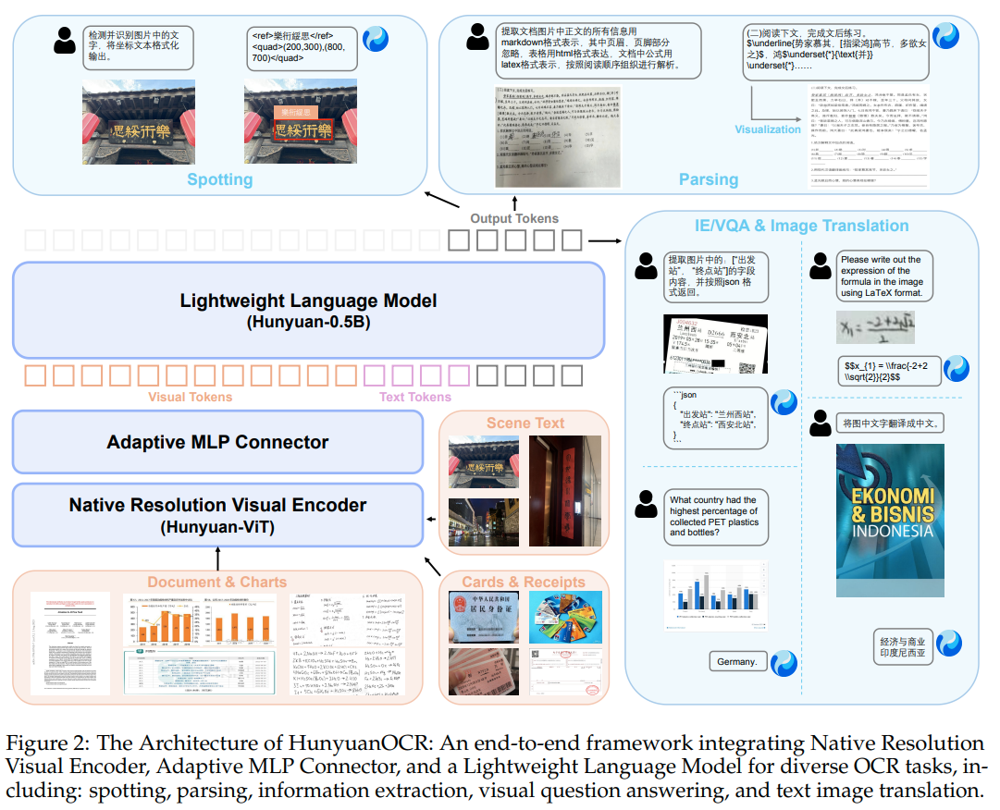

# Hunyuan-OCR推理详解
## 模型结构图

图片地址：[HunyuanOCR Technical Report](https://github.com/Tencent-Hunyuan/HunyuanOCR/blob/main/HunyuanOCR_Technical_Report.pdf)

### 输入数据
```json
{
    "model": "hunyuan-ocr",
        "messages": [
            {
                "role": "user",
                "content": [ 
                    {
                        "type": "image",
                        "image_url": 
                        {
                            "url": "https://images.liqucn.com/img/h02/h48/img_localize_2ec0a3d765e45582d4e06844969abb4a_480x854.png"
                        }
                    },               
                    {
                        "type": "text", 
                        "text": "检测并识别图片中的文字，将文本坐标格式化输出。"
                    }
                ]
            }
        ],
    "stream": false
}
```

## preprocess
### chat_template
* 参考视频：【rust本地化部署Qwen3-chat_template】https://www.bilibili.com/video/BV1xza1zKEEB/

### tokenize
* 参考视频：【理解语言模型的分词-BPE算法】https://www.bilibili.com/video/BV1X882zVEUZ/

### image preprocess
* Qwen2.5VL数据处理介绍： 
    * 参考博客： https://mp.weixin.qq.com/s/aEswVZN6wZqHmygh2Fcm-Q
    * 参考视频：【qwen2.5vl数据处理】 https://www.bilibili.com/video/BV1qcp1zfE7M/
* 图片提取并加载
* smart_resize: 将图片宽高resize成与原宽高最接近的32的倍数
    * 为什么是32：
        * 图像分块时，设置的块大小为16，
        * 图像的相邻块会有融合操作，merge大小是2
        * 32的倍数是为了保证上诉两个操作能正常进行
* 通道处理成rgb
* 维度（h, w, c）-> （c, h, w）
* 像素数据：（0-255的u8）-> （0，1的float/bfloat）
* normalize: 减去均值，再除以方差
* 维度 (c, h, w) => (1, c, h, w)
* 时间维度=1
* reshape:(1,
            channel,
            h / patch_size / merge_size,
            merge_size,
            patch_size,
            w / patch_size / merge_size,
            merge_size,
            patch_size)

* permute: (1,
        h / patch_size / merge_size,
        merge_size,
        w / patch_size / merge_size,
        merge_size,
        channel,
        patch_size,
        patch_size)
* reshape: (h / patch_size * w / patch_size, channel * patch_size * patch_size)
* 网格数据: 
    * grid_h = h / patch_size
    * grid_w = w/ patch_size
    
### token处理
* 将text中image_token重复num_vision_token次
    * num_vision_token = (h / patch_size / merge_size) * (w / patch_size / merge_size + 1) + 2
    * 后续图像处理会添加一些特殊的token嵌入
    * 后续将使用真实的vision token embedding数据替换掉image_token的嵌入向量，
* 得到images_seq_mask

### XD-RoPE位置id生成
* XD-RoPE: position_ids: (4, seq_len)
    * 第一行, 按整体序列生成： arange(0..seq_len)
    * 第二行，根据图像patch_h索引生成：  (0*(patch_w + 1), 1*(patch_w + 1)..(patch_h-1)*(patch_w + 1))
    * 第三行，根据图像patch_w索引生成： (0..patch_w+1) * patch_h
    * 第四行，全0代替

## Hunyuan-Vit
### PatchEmbed
1. conv2d
    * kernel_size: patch_size
    * stride: patch_size
    * out_channel: hidden_size=1152
    * (h / patch_size * w / patch_size, channel * patch_size, patch_size) 
    * -> (h / patch_size * w / patch_size, channel, patch_size, patch_size)
    * -> (h / patch_size * w / patch_size, out_c)
2. patch_pos_embed: (1, 138, 138, hidden_size)
    * 双线性插值->(1, grid_h, grid_w, hidden_size)
* output: 第一部分输出加上第二部分的pos_embed

### VisionLayers

### PatchMerger: Adaptive MLP Connector
1. before_rms
2. proj
    * conv2d: 
        * kernel_size: merge_size
        * stride_size: merge_size
        * in_c: hidden_size
        * out_c: hidden_size*2
    * gelu
    * conv2d: 
        * kernel_size: 1
        * in_c: hidden_size*2
        * out_c: hidden_size*4
3. cat image_newline:(hidden_size*4)
4. mlp
    * in_c: hidden_size*4
    * out_c: text_hidden_size: 1024
5. cat image_begin and image_end
5. after_rms

## Hunyuan 0.5B
* q/k norm,在q/k应用了旋转位置编码之后做的
* XD-RoPE
    * 只有第一层的attention才使用
    * position_ids: (4, seq_len)
    * -> (4, seq_len, head_dim)
    * -> (seq_len, 4, head_dim)
    * 128 / 4 -> 32
    * -> 4*(seq_len, 4, 32)
    * 4*(seq_len, 1, 32)
    * -> (seq_len, 128)

## rust推理代码
https://github.com/jhqxxx/aha/tree/main/src/models/hunyuan_ocr