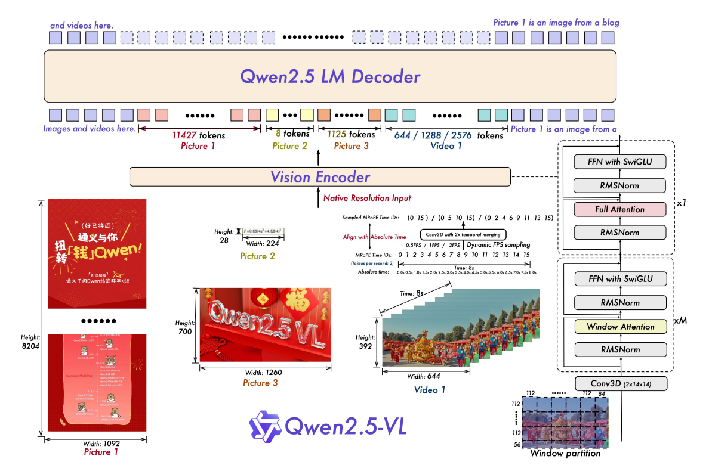
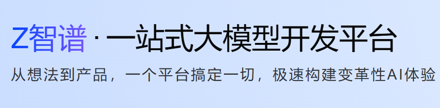

## Qwen2.5VL推理的rust实现
#### 模型结构图


##### rust代码
不完美推理实现代码链接：[https://github.com/jhqxxx/learn_qwen2_5_vl](https://github.com/jhqxxx/learn_qwen2_5_vl)

### 模型推理测试
* 输入数据：

```json
{
    "messages": [
        {
            "role": "user",
            "content": [
                {
                    "type": "image",
                    "image": "file://./assets/ocr_test.png"
                },
                {
                    "type": "text", 
                    "text": "请分析图片并提取所有可见文本内容，按从左到右、从上到下的布局，返回纯文本"
                }
            ]
        }
    ]
}
```

图片内容：


* 生成结果："Z智谱·一站式大模型开发平台\n从想法到产品，一个平台搞定一切，极速构建变革性AI体验"

### 模型详解
1. 数据预处理

    [数据预处理](qwen2_5_vl/data_process.md)

2. 视觉编码器

    [Vision Encoder](qwen2_5_vl/vision_encoder.md)

3. 语言模型解码器

    [LM Decoder](qwen2_5_vl/text_decoder.md)

