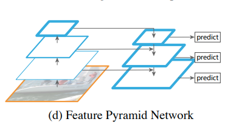
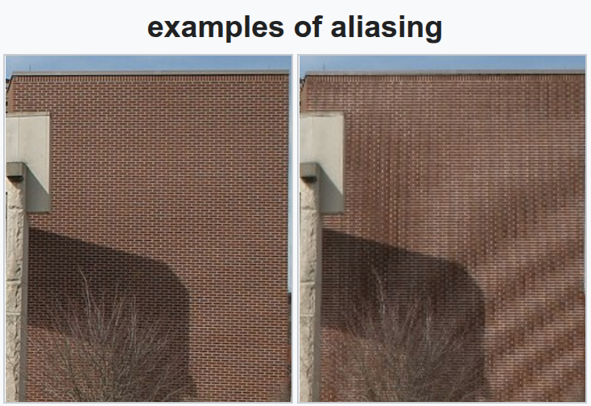
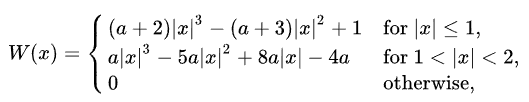

# 插值

## 什么是插值
一种通过已知的、离散的数据点来估算未知位置数据点的过程或方法。

### 应用
* 图像缩放：
    * 示例
        * 对于一些固定分辨率的模型，比如RMBG2.0-图像去背景，它的分辨率是1024*1024，
        * 图像预处理时：输入的任意尺寸图像resize成1024*1024大小后进行推理
        * 推理完成后得到的1024*1024的alpha图层->resize成输入的图片大小
* 特征图分辨率调整
    * 示例
        * FPN-特征金字塔
        
        * 不同下采样率的特征图信息不一样，低采样率的特征图语义信息少但是位置信息准确，高采样率语义信息丰富但是位置信息粗糙，FPN将不同分辨率的特征图组合起来
        * 640输入特征图，8/16/32的下采样->80/40/20的特征图。
        * 不同维度特征图使用插值处理成相同维度
* 数据重采样
    * 示例
        * 音频重采样
        * ASR/TTS模型一般是固定的采样率，比如16k
        * 输入的音频（如44.1k/22.05k）需要转换为模型使用的采样率

### aha库中插值的使用
#### Deepseek-OCR
* ImageEncoderViT-图像编码器中，添加训练的位置嵌入数据，位置嵌入的维度是固定的，但是因为deepseek-ocr配置里图像有多种尺寸512/640/1024/1280，所以需要将位置嵌入的维度处理成对应图像数据的维度，用到了线性插值和双三次插值

#### Paddle-OCR / Hunyuan-OCR
* 视觉嵌入过程中，添加训练的位置嵌入数据，位置嵌入的维度是固定的，patch处理时采用的自适应图像网格划分，不同的宽高划分后的网格宽高是不一样的，需要将位置嵌入的维度处理成对应的网格宽高，用到了双线性插值

#### RMBG2.0
* FPN结构中，将不同维度特征图使用插值处理成相同维度，再相加，用到了双线性插值

## 理解插值
### 问题
假设我们有一个一维张量包含10个数据点：
* [1.0, 2.0, 3.0, 4.0, 5.0, 6.0, 7.0, 8.0, 9.0, 10.0]
* 坐标: 0 1 2 3 4 5 6 7 8 9

目标：通过插值得到5个数据点

### 坐标映射
插值的本质是回答一个问题："输出的第i个数据，与输入数据的对应关系"

* 中心对齐：align_corners=false
```text
把数据点看作有面积的小方块，每个数据点代表其方块中心点的值
□────□────□────□────□────□────□────□────□────□
0    1    2    3    4    5    6    7    8    9 --坐标
0.5  1.5  2.5  3.5  4.5  5.5  6.5  7.5  8.5  9.5 --中心点
每个方块宽度 = 1.0
总长度 = 10.0

输出(5个点)：
□────□────□────□────□
0    1    2    3    4  --坐标
0.5  1.5  2.5  3.5  4.5  --中心点
总长度 = 5.0

缩放比例 scale = 10/5 = 2.0
输出点在输入中的位置：i_in = (i_out + 0.5) * scale - 0.5
```
* 角点对齐：align_corners=true    
```text
把数据点看作"点"，只关心数据中心点的位置
输入(10个点)：
●────●────●────●────●────●────●────●────●────●
0    1    2    3    4    5    6    7    8    9
总长度 = 9.0

输出(5个点)：
●────●────●────●────●
0    1    2    3    4
总长度 = 4.0

缩放比例 = 9/4 = 2.25
输出点在输入中的位置：i_in = i_out * scale
```
1. 计算缩放因子
```rust
fn compute_scale(input_size: usize, output_size: usize, align_corners: bool) -> f32 {
    if align_corners && output_size > 1 {
        (input_size - 1) as f32 / (output_size - 1) as f32
    } else {
        input_size as f32 / output_size as f32
    }
}
```
2. 计算输出点在输入中的位置
```rust
pub fn compute_1d_coords(
    input_size: usize,
    output_size: usize,
    align_corner: Option<bool>,
) -> Result<Vec<f32>> {
    if input_size == 0 {
        return Err(anyhow!("input_size must be > 0"));
    }
    if output_size == 0 {
        return Err(anyhow!("output_size must be > 0"));
    }
    if input_size == 1 {
        return Ok(vec![0f32; output_size]);
    }
    let align_corners = align_corner.unwrap_or(false);
    let scale = compute_scale(input_size, output_size, align_corners);
    if align_corners {
        Ok((0..output_size).map(|i| i as f32 * scale).collect())
    } else {
        Ok((0..output_size)
            .map(|i| {
                let coord = (i as f32 + 0.5) * scale - 0.5;
                coord.clamp(0.0, (input_size - 1) as f32)
            })
            .collect())
    }
}
```

### 最近邻插值
* 寻找坐标距离最近的数据作为它的值, 四舍五入
* 采用中心点对齐
```rust
// 1d:(bs, c, dim)
for b in 0..bs {
    for c in 0..channels {
        for i in 0..target_size {
            let coord = if target_size == 1 {
                (orig_size - 1) as f32 / 2.0
            } else {
                (i as f32 + 0.5) * (orig_size as f32 / target_size as f32) - 0.5
            };
            let nearest_idx = coord.round() as usize;
            let clamped_idx = nearest_idx.clamp(0, orig_size - 1);

            output_data[b][c][i] = input_data[b][c][clamped_idx];
        }
    }
}

// 2d: (bs, c, h, w) -> (bs*c, h, w)
for c in 0..dim0 {
    for i in 0..target_h {
        // 计算高度方向的最近邻坐标
        let coord_h = if target_h == 1 {
            (orig_h - 1) as f32 / 2.0
        } else {
            (i as f32 + 0.5) * (orig_h as f32 / target_h as f32) - 0.5
        };
        let nearest_h = coord_h.round() as usize;
        let clamped_h = nearest_h.clamp(0, orig_h - 1);

        for j in 0..target_w {
            // 计算宽度方向的最近邻坐标
            let coord_w = if target_w == 1 {
                (orig_w - 1) as f32 / 2.0
            } else {
                (j as f32 + 0.5) * (orig_w as f32 / target_w as f32) - 0.5
            };
            let nearest_w = coord_w.round() as usize;
            let clamped_w = nearest_w.clamp(0, orig_w - 1);

            output_data[c][i][j] = input_data[c][clamped_h][clamped_w];
        }
    }
}
```
### 线性插值
* align_corner可选
* 考虑左右两个点，使用权重来组合两个点的值
* 权重通过距离计算
```text
当align_corner=false时
输入10个点
□────□────□────□────□────□────□────□────□────□
0    1    2    3    4    5    6    7    8    9 --坐标
0.5  1.5  2.5  3.5  4.5  5.5  6.5  7.5  8.5  9.5 --中心点

输出(4个点)：
□────□────□────□
0    1    2    3  --坐标
0.5  1.5  2.5  3.5  --中心点
```
* scale = 10 / 4 = 2.5
* 当 i_out=1时，i_in = (i_out + 0.5) * scale - 0.5 = 3.25
* 计算左右邻点：
    * left_index = floor(3.25) = 3
    * right_index = left_index + 1 = 4
* 计算权重
    * dis_to_left = i_in - left_index = 0.25
    * dis_to_right = right_index - i_in = 0.75
    * 左邻点权重: weight_left = 1.0 - dis_to_left = 0.75
    * 右邻点权重: weight_right = 1.0 - dis_to_right = 0.25
* 插值计算
    * num_out = left_num * weight_left + right_num * weight_right

```rust
// 1d:(bs, c, dim)
let coords = compute_1d_coords(orig_size, target_size, align_corner)?;
for b in 0..bs {
    for c in 0..channels {
        for (i, &coord) in coords.iter().enumerate() {
            let coord = coord.clamp(0.0, (orig_size - 1) as f32);
            let x0 = coord.floor() as usize;
            let x1 = (x0 + 1).min(orig_size - 1);
            let weight = coord - x0 as f32;
            let value0 = input_data[b][c][x0];
            let value1 = input_data[b][c][x1];

            output_data[b][c][i] = value0 * (1.0 - weight) + value1 * weight;
        }
    }
}
```

### 双线性插值
* align_corner可选
* 线性插值的扩展，考虑两个维度，共4个点
```rust
// 2d: (bs, c, h, w) -> (bs*c, h, w)
for c in 0..dim0 {
    for (i, &coord_h) in coords_h.iter().enumerate() {
        let coord_h = coord_h.clamp(0.0, (input_height - 1) as f32);
        let y0 = coord_h.floor() as usize;
        let y1 = (y0 + 1).min(input_height - 1);
        let dy = coord_h - y0 as f32;
        for (j, &coord_w) in coords_w.iter().enumerate() {
            let coord_w = coord_w.clamp(0.0, (input_width - 1) as f32);
            let x0 = coord_w.floor() as usize;
            let x1 = (x0 + 1).min(input_width - 1);
            let dx = coord_w - x0 as f32;

            let q00 = input_data[c][y0][x0];
            let q01 = input_data[c][y0][x1];
            let q10 = input_data[c][y1][x0];
            let q11 = input_data[c][y1][x1];
            output_data[c][i][j] = q00 * (1.0 - dx) * (1.0 - dy)
                + q01 * dx * (1.0 - dy)
                + q10 * (1.0 - dx) * dy
                + q11 * dx * dy;
        }
    }
}
```
* 抗锯齿设置 antialias: bool

* 下采样时有效，antialias=True时，align_corners=False
* 根据scale,扩大考虑范围
```rust
fn antialias_filter(x: f32) -> f32 {
    let x = x.abs();
    if x < 1.0 { 1.0 - x } else { 0.0 }
}
let support_size = scale_h.max(scale_w);
// 2d: (bs, c, h, w) -> (bs*c, h, w)
for c in 0..dim0 {
    for out_y in 0..target_height {
        let center_y = (out_y as f32 + 0.5) * scale_h - 0.5;
        let start_y = (center_y - support_size).max(0.0) as usize;
        let end_y = (center_y + support_size).min(input_height as f32 - 1.0) as usize;
        for out_x in 0..target_width {
            let center_x = (out_x as f32 + 0.5) * scale_w - 0.5;
            let start_x = (center_x - support_size).max(0.0) as usize;
            let end_x = (center_x + support_size).min(input_width as f32 - 1.0) as usize;
            let mut total_weight = 0.0;
            let mut weighted_sum = 0.0;

            for src_y in start_y..end_y + 1 {
                for src_x in start_x..end_x + 1 {
                    let dist_x = (src_x as f32 - center_x).abs();
                    let dist_y = (src_y as f32 - center_y).abs();
                    let weight_x = antialias_filter(dist_x / scale_w);
                    let weight_y = antialias_filter(dist_y / scale_h);
                    let weight = weight_x * weight_y;
                    weighted_sum += input_data[c][src_y][src_x] * weight;
                    total_weight += weight;
                }
            }
            let result = if total_weight > 0.0 {
                weighted_sum / total_weight
            } else {
                let y = center_y.round().clamp(0.0, (input_height - 1) as f32) as usize;
                let x = center_x.round().clamp(0.0, (input_width - 1) as f32) as usize;
                input_data[c][y][x]
            };
            output_data[c][out_y][out_x] = result;
        }
    }
}
```

### 双三次插值
* align_corner可选
* 单方向取四个点，宽高两个维度，共16个点
* 权重计算方式

* 抗锯齿设置 antialias=false或上采样： a=-0.75
```rust
fn cubic_convolution1(x: f64, a: f64) -> f64 {
    ((a + 2.0) * x - (a + 3.0)) * x * x + 1.0
}

// 三次卷积函数2
fn cubic_convolution2(x: f64, a: f64) -> f64 {
    (((x - 5.0) * x + 8.0) * x - 4.0) * a
}

fn get_cubic_coefficients(t: f64, a: f64) -> [f64; 4] {
    let coeff0 = cubic_convolution2(t + 1.0, a);
    let coeff1 = cubic_convolution1(t, a);
    let coeff2 = cubic_convolution1(1.0 - t, a);
    let coeff3 = cubic_convolution2(1.0 - t + 1.0, a);

    [coeff0, coeff1, coeff2, coeff3]
}

fn cubic_interp1d(x0: f32, x1: f32, x2: f32, x3: f32, t: f64, a: f64) -> f32 {
    let coeffs = get_cubic_coefficients(t, a);
    x0 * coeffs[0] as f32 + x1 * coeffs[1] as f32 + x2 * coeffs[2] as f32 + x3 * coeffs[3] as f32
}
for c in 0..dim0 {
    for out_y in 0..target_height {
        let center_y = if align_corners {
            out_y as f32 * scale_h
        } else {
            (out_y as f32 + 0.5) * scale_h - 0.5
        }
        .clamp(0.0, (input_height - 1) as f32);
        let in_y = center_y.floor() as isize;
        let t_y = center_y - in_y as f32;
        for out_x in 0..target_width {
            let center_x = if align_corners {
                out_x as f32 * scale_w
            } else {
                (out_x as f32 + 0.5) * scale_w - 0.5
            }
            .clamp(0.0, (input_width - 1) as f32);
            let in_x: isize = center_x.floor() as isize;
            let t_x = center_x - in_x as f32;
            let mut coefficients = [0.0; 4];
            for k in 0..4 {
                let row = (in_y - 1 + k as isize).clamp(0, input_height as isize - 1) as usize;
                let x_minus_1 =
                    input_data[c][row][(in_x - 1).clamp(0, input_width as isize - 1) as usize];
                let x_plus_0 =
                    input_data[c][row][in_x.clamp(0, input_width as isize - 1) as usize];
                let x_plus_1 =
                    input_data[c][row][(in_x + 1).clamp(0, input_width as isize - 1) as usize];
                let x_plus_2 =
                    input_data[c][row][(in_x + 2).clamp(0, input_width as isize - 1) as usize];

                coefficients[k] =
                    cubic_interp1d(x_minus_1, x_plus_0, x_plus_1, x_plus_2, t_x as f64, -0.75);
            }
            output_data[c][out_y][out_x] = cubic_interp1d(
                coefficients[0],
                coefficients[1],
                coefficients[2],
                coefficients[3],
                t_y as f64,
                -0.75,
            );
        }
    }
}
```
* 抗锯齿设置 antialias = true且下采样时，a = -0.5
* 根据scale, 扩大考虑范围
```rust
fn bicubic_filter(x: f32, a: f32) -> f32 {
    let x = x.abs();
    if x < 1.0 {
        ((a + 2.0) * x - (a + 3.0)) * x * x + 1.0
    } else if x < 2.0 {
        (((x - 5.0) * x + 8.0) * x - 4.0) * a
    } else {
        0.0
    }
}

let scale = scale_h.max(scale_w);
let support_size = if scale >= 1.0 {
    (2.0 * scale).ceil()
} else {
    2.0
};
for c in 0..dim0 {
    for out_y in 0..target_height {
        let center_y = (out_y as f32 + 0.5) * scale_h - 0.5;
        let start_y = (center_y - support_size).ceil() as isize;
        let end_y = (center_y + support_size).floor() as isize;
        for out_x in 0..target_width {
            let center_x = (out_x as f32 + 0.5) * scale_w - 0.5;
            let start_x = (center_x - support_size).ceil() as isize;
            let end_x = (center_x + support_size).floor() as isize;
            let mut sum = 0.0;
            let mut weight_sum = 0.0;
            for iy in start_y..end_y + 1 {
                for ix in start_x..end_x + 1 {
                    if iy >= 0
                        && iy < input_height as isize
                        && ix >= 0
                        && ix < input_width as isize
                    {
                        let dx = (ix as f32 - center_x).abs();
                        let dy = (iy as f32 - center_y).abs();
                        let wx = bicubic_filter(dx / scale_w.max(1.0), -0.5);
                        let wy = bicubic_filter(dy / scale_h.max(1.0), -0.5);
                        let weight = wx * wy;
                        sum += input_data[c][iy as usize][ix as usize] * weight;
                        weight_sum += weight;
                    }
                }
            }
            if weight_sum > 0.0 {
                output_data[c][out_y][out_x] = sum / weight_sum;
            } else {
                let y = center_y.round().clamp(0.0, (input_height - 1) as f32) as usize;
                let x = center_x.round().clamp(0.0, (input_width - 1) as f32) as usize;
                output_data[c][out_y][out_x] = input_data[c][y][x];
            }
        }
    }
}
```


完整代码地址： [https://github.com/jhqxxx/aha/blob/main/src/utils/interpolate.rs](https://github.com/jhqxxx/aha/blob/main/src/utils/interpolate.rs)