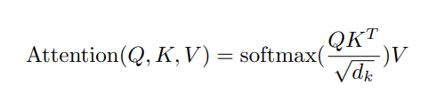
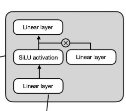
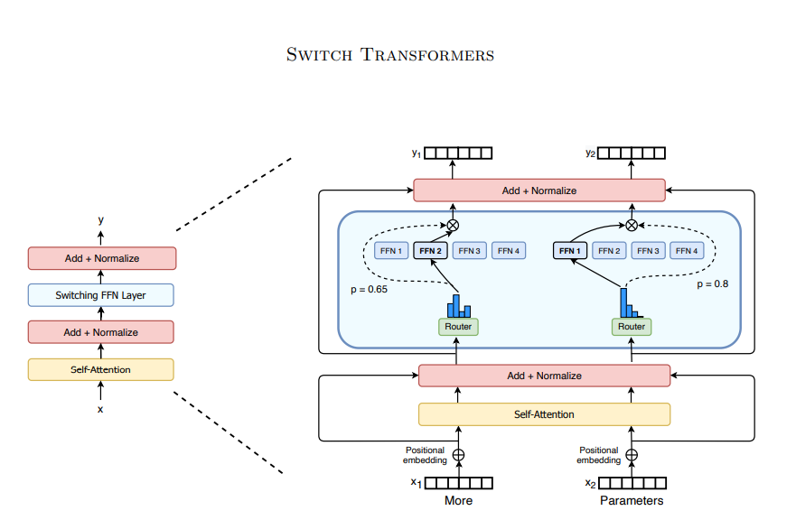

# MOE-混合专家模型
在学习MOE前，我们来复习一下语言模型两个很重要的组件 1. Attention、2. FFN，理解他们的主要作用

#### Attention-注意力机制
注意力机制-建立全局关联与上下文理解

注意力层的关键在于“关联”。就像人阅读时会把句子中相关的词联系起来一样。
对于一个输入序列中的每一个token，它会计算该token（Query）与序列中其他token（Key）之间的“相关性”或“注意力分数”。



1. **注意力分数**： 通过计算Query向量和Key向量的点积（或其他相似度计算），然后进行缩放和Softmax归一化得到。分数高的表示该token与当前token高度相关。

1. **加权求和**： 将计算出的注意力分数作为权重，对Value向量进行加权求和。得到的加权和向量就是当前token的新表示，它融合了整个序列中与其最相关的信息。
使得token的表示不再是孤立的，而是根据它在整个句子/段落中的具体语境动态生成的。

#### FFN-前馈神经网络
前馈神经网络-执行非线性变换与特征增强



FFN层更像是“深度思考”。当注意力层理清词之间的关系后，FFN负责对这些关系进行复杂转换。
对每个token的表示向量进行独立、复杂的非线性变换，学习更深层次的特征表示，增加模型的表达能力。

### 为什么FFN重要
1. **特征抽象与转换**： FFN层可以看作是在每个token位置上独立运行的一个小型特征提取器/转换器。它将Attention层输出的、富含上下文信息的表示，进一步提炼、转换、映射到一个更高维或更有判别性的特征空间（通过中间的 hidden_dim 维度），然后再投影回原始维度。这个过程允许模型学习到更深入、更组合性的特征。

2. **位置独立性**： FFN作用于序列中的每一个token位置，且处理是独立进行的（不像Attention需要交互token信息）。这使得模型可以专注于对单个token表示的深度加工。

## MOE: 扩展FFN - 混合专家模型
混合专家模型(Mixture of Experts)通过引入多个"专家"网络和一个"门控"网络来扩展传统FFN层的能力，它的核心思想是：**用一组分工协作的专家取代单一的FFN**。



### MOE的核心组件
1. **专家**：
    * 通常就是多个独立的FFN层。
    * 每个专家可以看作是一个专门领域的特征处理器，不同专家可以学习处理输入数据的不同方面或模式。
    * 专家个数是人为配置的(比如64，128)。
2. **门控网络**：
    * 是一个简单的神经网络，通常是一个线性层+Softmax。
    * 它**为每个token计算一个权重分布**，决定该token应该分配给哪些专家处理，以及每个专家占多少权重。

### MOE的工作流程
1. **路由决策**：
    * 每个token的向量输入门控网络。
    * 门控网络输出每个token在`N`个专家上的权重分布。
    * 通常只选择权重值最大的前`k`个专家(k也是人为配置的，比如1，2)来处理该token，这被称为Top-k路由。
2. **专家处理**：
    * 被选中的`k`个专家各自对这个token进行处理。
3. **加权组合**：
    * 将`k`个专家的输出结果，按照门控网络计算出的权重进行加权求和。
    * 加权后的输出就是MOE层的输出结果。

### MOE的核心优势
参数量大，但计算量是可控的，MOE层的总参数量等于所有专家网络的参数量之和和门控网络，可以变得非常庞大。极大的扩展了模型的表示能力和学习复杂模式的能力。但是对于每个输入的token，由于只激活了`k`个专家，其实际计算量相当于`k`个专家，远小于使用全部的`N`个专家，使得模型在保持极高容量的同时，显著降低了训练和推理的计算成本。

### MOE带来的挑战
1. **训练不稳定**：门控网络的训练可能不稳定，出现专家不均衡，等情况。
2. **显存消耗**：虽然计算是稀疏的，但是模型的参数是需要加载到显存中的。
3. ...

### rust实现代码
完整代码链接：https://github.com/jhqxxx/learn_candle
1. **FeedForward**

```rust
pub struct FeedForward {
    up: Linear,
    gate: Linear,
    down: Linear,
}

#[allow(unused)]
impl FeedForward {
    pub fn new(vb: VarBuilder, in_dim: usize, hidden_dim: usize, out_dim: usize) -> Result<Self> {
        let up = linear_no_bias(in_dim, hidden_dim, vb.pp("up"))?;
        let gate = linear_no_bias(in_dim, hidden_dim, vb.pp("gate"))?;
        let down = linear_no_bias(hidden_dim, out_dim, vb.pp("down"))?;
        Ok(Self { up, gate, down })
    }
    pub fn forward(&self, x: &Tensor) -> Result<Tensor> {
        let up_x = self.up.forward(x)?;
        let gate_x = self.gate.forward(x)?.silu()?;
        let mul_cat = up_x.mul(&gate_x)?;
        let down = self.down.forward(&mul_cat)?;
        Ok(down)
    }
}
```

2. **MOE**

```rust
pub struct SparseMoeBlock {
    router: Linear,
    experts: Vec<FeedForward>,
    norm_topk_prob: bool,
    num_experts_per_tok: usize,
}

impl SparseMoeBlock {
    pub fn new(
        vb: VarBuilder,
        in_dim: usize,
        hidden_dim: usize,
        num_experts: usize,
        norm_topk_prob: bool,
        num_experts_per_tok: usize,
    ) -> Result<Self> {
        let router = linear_no_bias(in_dim, num_experts, vb.pp("router"))?;
        let mut experts = Vec::with_capacity(num_experts);
        let vb_e = vb.pp("experts");
        for idx in 0..num_experts {
            let expert = FeedForward::new(vb_e.pp(idx), in_dim, hidden_dim, in_dim)?;
            experts.push(expert);
        }
        Ok(Self {
            router,
            experts,
            norm_topk_prob,
            num_experts_per_tok,
        })
    }

    pub fn forward(&self, x: &Tensor) -> Result<Tensor> {
        let (bs, seq_len, embedding_dim) = x.dims3()?;
        let x = x.reshape(((), embedding_dim))?;
        let router_logits = self.router.forward(&x)?;
        let router_weights = ops::softmax_last_dim(&router_logits)?;

        let select_experts = router_weights
            .arg_sort_last_dim(false)?
            .narrow(D::Minus1, 0, self.num_experts_per_tok)?
            .contiguous()?;

        let mut router_weights = router_weights.gather(&select_experts, D::Minus1)?;
        if self.norm_topk_prob {
            router_weights =
                router_weights.broadcast_div(&router_weights.sum_keepdim(D::Minus1)?)?;
        }
        let expert_mask = one_hot(&select_experts, self.experts.len())?.permute((2, 1, 0))?;
        let exprt_hit = expert_mask.sum((D::Minus1, D::Minus2))?;
        let expert_hit_vec = exprt_hit.to_vec1::<u8>()?;
        let expert_hit_vec: Vec<usize> = expert_hit_vec
            .iter()
            .enumerate()
            .filter_map(|(i, &val)| if val != 0 { Some(i as usize) } else { None })
            .collect();

        let mut final_x = x.zeros_like()?;
        for expert_idx in expert_hit_vec {
            let expert_layer = &self.experts[expert_idx];
            let expert_tokens = expert_mask.i(expert_idx)?;
            let (top_expert, token_ids) = nonzero(&expert_tokens)?;

            let tokens = Tensor::new(token_ids.as_slice(), x.device())?;
            let current_state = x.index_select(&tokens, 0)?;
            let current_hidden_states = expert_layer.forward(&current_state)?;

            let expert_ratio = router_weights.index_select(&tokens, 0)?.gather(
                &Tensor::new(top_expert.as_slice(), x.device())?.unsqueeze(D::Minus1)?,
                1,
            )?;

            let current_hidden_states = current_hidden_states.broadcast_mul(&expert_ratio)?;
            final_x = final_x.index_add(&tokens, &current_hidden_states, 0)?;
        }
        final_x = final_x.reshape((bs, seq_len, embedding_dim))?;
        Ok(final_x)
    }
}
```

3. **MOEAttentionBlock**

```rust
pub struct MoeAttentionBlock {
    rms_norm1: RMSNorm,
    attention: GroupAttentionWithKVCache,
    rms_norm2: RMSNorm,
    moe: SparseMoeBlock,
}
```