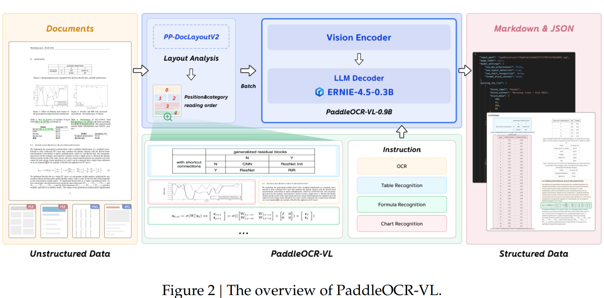
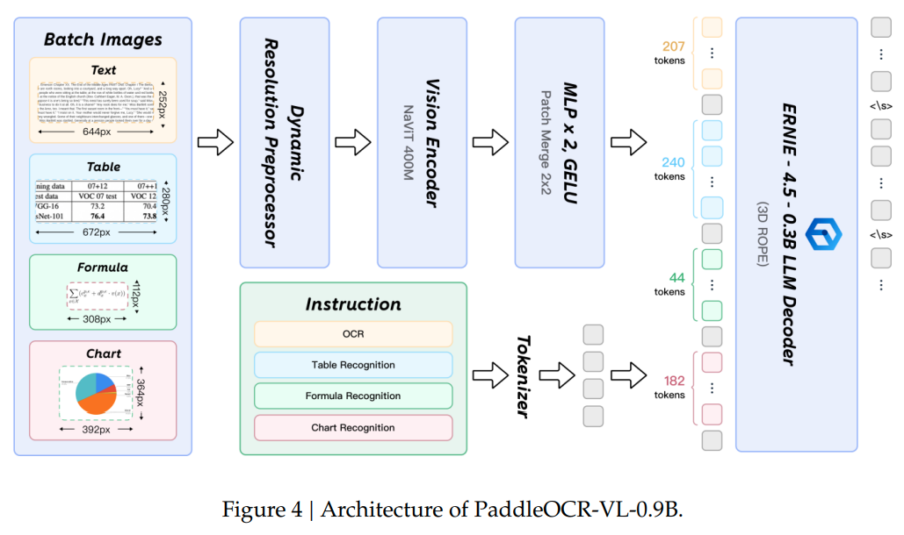

# PaddleOCR-VL推理详解
## 模型结构图




图片地址：[PaddleOCR-VL: Boosting Multilingual Document Parsing
via a 0.9B Ultra-Compact Vision-Language Model](https://arxiv.org/pdf/2510.14528)

* 支持的指令
    * OCR:
    * Table Recognition:
    * Formula Recognition:
    * Chart Recognition:

### 输入数据
```json
{
    "model": "paddleocr_vl",
    "messages": [
        {
            "role": "user",
            "content": [ 
                {
                    "type": "image",
                    "image_url": 
                    {
                        "url": "file://./assets/img/ocr_test1.png"
                    }
                },              
                {
                    "type": "text", 
                    "text": "OCR:"
                }
            ]
        }
    ],
    "stream": false,
}
```
## preprocess
### chat_template
* 参考视频：【rust本地化部署Qwen3-chat_template】https://www.bilibili.com/video/BV1xza1zKEEB/

### tokenize
* 参考视频：【理解语言模型的分词-BPE算法】https://www.bilibili.com/video/BV1X882zVEUZ/

### image preprocess
* Qwen2.5VL数据处理介绍： 
    * 参考博客： https://mp.weixin.qq.com/s/aEswVZN6wZqHmygh2Fcm-Q
    * 参考视频：【qwen2.5vl数据处理】 https://www.bilibili.com/video/BV1qcp1zfE7M/
* 不一样的地方：
    * temporal_patch_size = 1
    * grid_t = 1
    * image data reshape时没有merge_size维度参与
* 输出
    * image:(grid_t * grid_h * grid_w, channel,patch_size, patch_size)
    * grid: (img_num, 3), (grid_t, grid_h, grid_w)

### token处理


