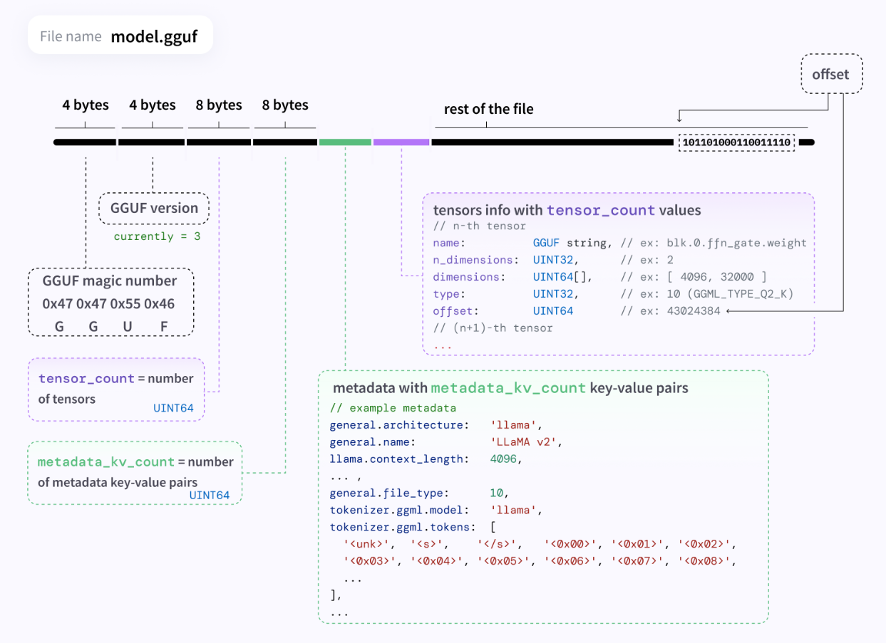

# GGUF
GGUF是一种模型的存储格式，二进制格式，专为快速加载和保存模型以及便于读取而设计。

[GGUF规范文档](https://github.com/ggml-org/ggml/blob/master/docs/gguf.md)

* 作者：Georgi Gerganov

## GGUF文件命名规则： 
\<BaseName>\<SizeLabel>\<FineTune>\<Version>\<Encoding>\<Type>\<Shard>.gguf

* 示例
    * Mixtral-8x7B-v0.1-KQ2.gguf
    * Qwen3.5-0.8B-Q4_K_M.gguf
    * Qwen3.5-35B-A3B-Q3_K_M.gguf

## GGUF文件结构


* 用candle库加载gguf
```rust
let path = "/home/jhq/.aha/Qwen/Qwen3.5-0.8B-GGUF/Qwen3.5-0.8B-Q4_K_M.gguf";
let mut file = std::fs::File::open(path)?;
let model = candle_core::quantized::gguf_file::Content::read(&mut file)?;
```

* Content结构
```rust
#[derive(Debug)]
pub struct Content {
    pub magic: VersionedMagic, // 魔数及版本
    pub metadata: HashMap<String, Value>, // 元数据
    pub tensor_infos: HashMap<String, TensorInfo>, // 张量信息
    pub tensor_data_offset: u64, // 张量数据起始偏移量
}

#[derive(Debug)]
pub struct TensorInfo {
    pub ggml_dtype: GgmlDType,  // 量化数据类型
    pub shape: crate::Shape,   // 数据维度
    pub offset: u64,  // 数据偏移量
}
```