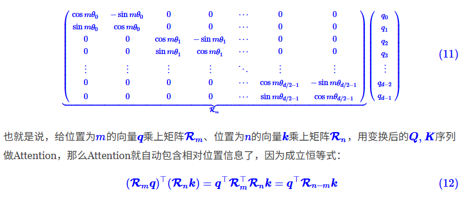
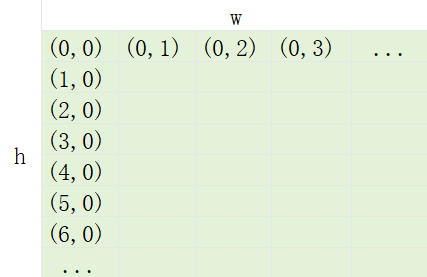

## 2D_RoPE

[位置编码参考视频](https://www.bilibili.com/video/BV1KXhVzVEGK/)

[1D_RoPE参考视频](https://www.bilibili.com/video/BV1p2tnzSECq/)

[1D_RoPE参考博客](https://kexue.fm/archives/8265)

[2D_RoPE参考博客](https://kexue.fm/archives/8397)

#### 简单复习位置编码
* 输入：（bs, seq_len, head_dim）
* 找到一个方法来表示sqence中token位置信息
* 可学习的位置编码
* 固定位置编码
* 相对位置编码-RoPE

#### 简单复习RoPE
* q,k都乘上位置矩阵
* 位置编码生成
    * theta： θi=10000−2i/d
    * i: arange(0..head_dim).step_by(2)
    * head_dim / 2 个theta
    * m: arange(0..seq_len)

### RoPE扩展-2D
* 在2D情况下，需要同时考虑高度（h）和宽度（w）两个方向的位置信息
* 图像的patch块宽高索引

* 根据grid_h和grid_w生成索引
* 考虑后续merge操作，将要merge的块索引处理到一起
* 位置编码生成
    * theta： θi=10000−2i/d
    * i: arange(0..head_dim/2).step_by(2)
    * head_dim / 4 个 theta
    * m: arange(0..max(h, w))
* 分别按宽高位置取到对应的旋转位置编码
* 再将宽高位置编码cat到一起，维度从head_dim/4->head_dim/2
* 每个patch就融合h索引和w索引的位置编码信息