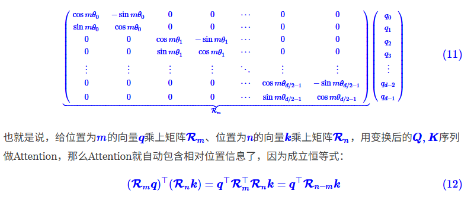
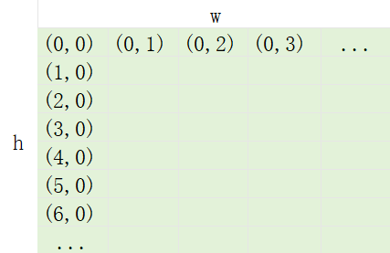

## Qwen2.5VL-Vision Encode-2D_RoPE

[位置编码参考视频](https://www.bilibili.com/video/BV1KXhVzVEGK/)

[1D_RoPE参考视频](https://www.bilibili.com/video/BV1p2tnzSECq/)

[1D_RoPE参考博客](https://kexue.fm/archives/8265)

[2D_RoPE参考博客](https://kexue.fm/archives/8397)

#### 简单复习位置编码
* 输入：（bs, seq_len, head_dim）
* 找到一个方法来表示sqence中token位置信息
* 可学习的位置编码
* 固定位置编码
* 相对位置编码-RoPE

#### 简单复习RoPE
* q,k都乘上位置矩阵
* 位置编码生成
    * theta： θ<sub>i</sub>=10000<sup>−2i/d<sup>
    * i: arange(0..head_dim).step_by(2)
    * head_dim / 2 个theta
    * m: arange(0..seq_len)




### RoPE扩展-2D
* 在2D情况下，需要同时考虑高度（h）和宽度（w）两个方向的位置信息
* 图像的patch块宽高索引

* 根据grid_h和grid_w生成索引
* 考虑后续merge操作，将要merge的块索引处理到一起
* 位置编码生成
    * theta： θ<sub>i</sub>=10000<sup>−2i/d<sup>
    * i: arange(0..head_dim/2).step_by(2)
    * head_dim / 4 个 theta
    * m: arange(0..max(h, w))
* 分别按宽高位置取到对应的旋转位置编码
* 再将宽高位置编码cat到一起，维度从head_dim/4->head_dim/2
* 每个patch就融合h索引和w索引的位置编码信息

### rust

```rust
pub fn rot_pos_emb(&self, grid_thw: &Tensor) -> Result<Tensor> {
        let mut pos_ids = Vec::new();
        for i in 0..grid_thw.dim(0)? {
            let [t, h, w] = grid_thw.i(i)?.to_vec1::<u32>()?[..] else {
                return Err(Error::Msg(format!("grid_thw Expected exactly 3 elements")));
            };
            // hpos_ids shape (h, w)
            let hpos_ids = Tensor::arange(0, h, grid_thw.device())?
                .unsqueeze(1)?
                .expand((h as usize, w as usize))?;
            let hpos_ids = hpos_ids.reshape((
                h as usize / self.spatial_merge_size,
                self.spatial_merge_size,
                w as usize / self.spatial_merge_size,
                self.spatial_merge_size,
            ))?;
            let hpos_ids = hpos_ids.permute((0, 2, 1, 3))?.flatten_all()?;
            let wpos_ids = Tensor::arange(0, w, grid_thw.device())?
                .unsqueeze(0)?
                .expand((h as usize, w as usize))?;
            let wpos_ids = wpos_ids.reshape((
                h as usize / self.spatial_merge_size,
                self.spatial_merge_size,
                w as usize / self.spatial_merge_size,
                self.spatial_merge_size,
            ))?;
            let wpos_ids = wpos_ids.permute((0, 2, 1, 3))?.flatten_all()?;
            // thw_pos_ids shape (h*w, 2)
            let thw_pos_ids =
                Tensor::stack(&[&hpos_ids, &wpos_ids], D::Minus1)?.repeat((t as usize, 1))?;
            pos_ids.push(thw_pos_ids);
        }
        let pos_ids = Tensor::cat(&pos_ids, 0)?.contiguous()?;
        let max_grid_size = grid_thw.i((.., 1..))?.max_all()?.to_scalar::<u32>()?;
        let rotary_pos_emb_full = self
            .rotary_pos_emb
            .forward(max_grid_size as usize, grid_thw.device())?;

        // contiguous()一定要加！！！很重要！！！！，不然index_select出来的是错的
        // 找错找了半天，都是泪啊，做维度索引操作后contiguous顺手写上总没错
        // 第一列是h维度的索引
        let pos_ids_h = pos_ids.i((.., 0))?.contiguous()?;
        // 第二列是w维度的索引
        let pos_ids_w = pos_ids.i((.., 1))?.contiguous()?;
        let rotary_pos_emb_h = rotary_pos_emb_full.index_select(&pos_ids_h, 0)?;
        let rotary_pos_emb_w = rotary_pos_emb_full.index_select(&pos_ids_w, 0)?;
        // 每个patch融合h索引和w索引两个的位置编码信息
        let rotary_pos_emb = Tensor::cat(&[rotary_pos_emb_h, rotary_pos_emb_w], 1)?.contiguous()?;
        Ok(rotary_pos_emb)
    }
```