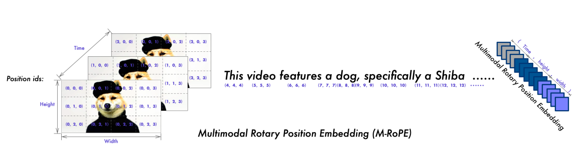
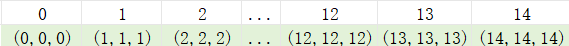
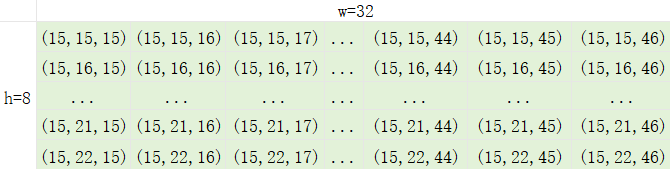
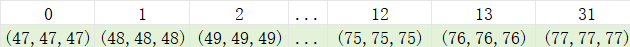

## Qwen2.5VL语言模型

1. 输入数据
    * input_ids:
        ```text
        [[151644,   8948,    198,   2610,    525,    264,  10950,  17847,     13, 151645,
        198, 151644,    872,    198, 151652, 151655, 151655, 151655, 151655, 151655,
        151655, 151655, 151655, 151655, 151655, 151655, 151655, 151655, 151655, 151655,
        151655, 151655, 151655, 151655, 151655, 151655, 151655, 151655, 151655, 151655,
        151655, 151655, 151655, 151655, 151655, 151655, 151655, 151655, 151655, 151655,
        151655, 151655, 151655, 151655, 151655, 151655, 151655, 151655, 151655, 151655,
        151655, 151655, 151655, 151655, 151655, 151655, 151655, 151655, 151655, 151655,
        151655, 151655, 151655, 151655, 151655, 151655, 151655, 151655, 151655, 151655,
        151655, 151655, 151655, 151655, 151655, 151655, 151655, 151655, 151655, 151655,
        151655, 151655, 151655, 151655, 151655, 151655, 151655, 151655, 151655, 151655,
        151655, 151655, 151655, 151655, 151655, 151655, 151655, 151655, 151655, 151655,
        151655, 151655, 151655, 151655, 151655, 151655, 151655, 151655, 151655, 151655,
        151655, 151655, 151655, 151655, 151655, 151655, 151655, 151655, 151655, 151655,
        151655, 151655, 151655, 151655, 151655, 151655, 151655, 151655, 151655, 151655,
        151655, 151655, 151655, 151655, 151655, 151655, 151655, 151655, 151655, 151655,
        151655, 151655, 151655, 151655, 151655, 151655, 151655, 151655, 151655, 151655,
        151655, 151655, 151655, 151655, 151655, 151655, 151655, 151655, 151655, 151655,
        151655, 151655, 151655, 151655, 151655, 151655, 151655, 151655, 151655, 151655,
        151655, 151655, 151655, 151655, 151655, 151655, 151655, 151655, 151655, 151655,
        151655, 151655, 151655, 151655, 151655, 151655, 151655, 151655, 151655, 151655,
        151655, 151655, 151655, 151655, 151655, 151655, 151655, 151655, 151655, 151655,
        151655, 151655, 151655, 151655, 151655, 151655, 151655, 151655, 151655, 151655,
        151655, 151655, 151655, 151655, 151655, 151655, 151655, 151655, 151655, 151655,
        151655, 151655, 151655, 151655, 151655, 151655, 151655, 151655, 151655, 151655,
        151655, 151655, 151655, 151655, 151655, 151655, 151655, 151655, 151655, 151655,
        151655, 151655, 151655, 151655, 151655, 151655, 151655, 151655, 151655, 151655,
        151655, 151655, 151655, 151655, 151655, 151655, 151655, 151655, 151655, 151655,
        151655, 151653,  14880, 101042,  45930,  62926, 107439,  55338, 101479, 108704,
        43815,   3837,  59879,  45181,  77559,  26939,  64817,   5373,  45181,  17447,
        26939, 101373, 102006,   3837,  31526, 100073, 108704, 151645,    198, 151644,
        77091,    198]]
        Tensor[[1, 302], u32, cuda:0]
        ```
    * 
2. 词嵌入： (302, 2048)
3. 使用vision token替换掉<\|image_pad\|>或者<\|video_pad\|>所在的token嵌入

### MRoPE



#### 示例数据
1. input_ids: shape(1, 302)
2. grid_thw: [[1, 16, 64]] -> merge后 [[1, 8, 32]], 一共256个token

3. position_ids: (3, bs, seq_len)->(3, 1, 302)
    * bs=1，不考虑bs的维度，（3，302）
    * 前面15个token是文本token, 中间256个token是视觉token，后面31个tokens也是文本token
    * 文本token的三个维度，t/h/w使用相同的索引
    * 视觉token根据真实t/h/w生成
    * 前15个token生成的position_ids

        
    * tensor表示
        ```text
        [[0, 1, 2, ... 12, 13, 14],
         [0, 1, 2, ... 12, 13, 14],
         [0, 1, 2, ... 12, 13, 14]]
         shape: (3, 15)
        ```
    
    * 中间256个视觉token生成的position_ids：

        
    
    * tensor表示
        ```text
        [[15, 15, 15, ... 15, 15, 15],
         [15, 15, 15, ..., 16, 16, 16, ..., 17, 17, 17, ...22, 22, 22],
         [15, 16,...45，46, 15, 16,...45，46,..., 15, 16,...45，46]]
         shape: (3, 256)
        ```

    * 后面31个text token生成的position_ids:

        

    * tensor表示
        ```text
        [[47, 48, 49, ... 75, 76, 77],
         [47, 48, 49, ... 75, 76, 77],
         [47, 48, 49, ... 75, 76, 77]]
         shape: (3, 31)
        ```
4. 对于视频，根据一个网格时间代表的真实时间增加t维度的索引
5. 生成过程中的position_ids由之前的最大值加1得到

6. position embed
    * position_ids: (3, 1, 302)
    * freqs: (1, head_dim)
    * pos_emb: (3, 1, 302, head_dim) head_dim=128
    * 将三个维度的位置编码合并  
        * 128 -> [16, 24, 24, 16, 24, 24]
        * 6个子矩阵（3，1，302，0..16），（3，1，302，16..24）...
        * 0维的3分别对应时序id, 高度id, 宽度id
        * 从0维取子矩阵再拼接起来
        * 将三个独立的位置信息融合到最终的旋转嵌入中
        * (1, 1, 302, 128)

### Qwen2 LLM
常见因果注意力模型

[代码地址](https://github.com/jhqxxx/learn_qwen2_5_vl)