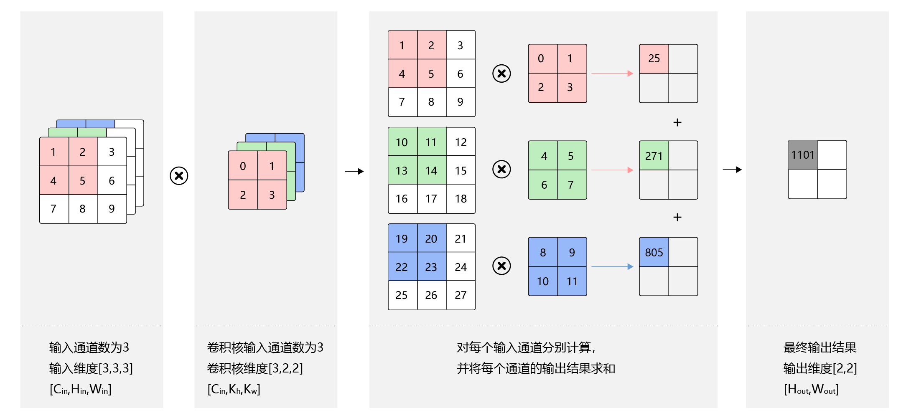
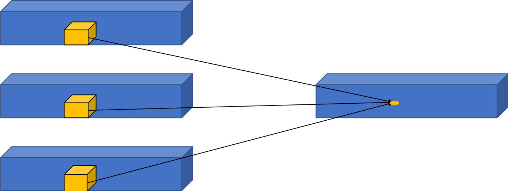

## Qwen2.5VL视觉编码器

#### 输入数据
* pixel_values: 
    ```text
    Tensor[[grid_t*grid_h_grid_w, 1176], bf16, cuda:0]
    ```
* image_grid_thw: 
    ```text
    image_grid_thw: [[grid_t, grid_h, grid_w]]
    Tensor[[1, 3], u32, cuda:0]
    ```

### PatchEmbed
* candle库中conv3D的算子暂不支持，那要如何实现patch embed中的Conv3D操作呢
* 回顾一下卷积计算
    
    
    图片来源：[飞桨深度学习基础篇卷积算子](https://paddlepedia.readthedocs.io/en/latest/tutorials/CNN/convolution_operator/index.html)

* pixel_value做卷积操作：
    * 输入维度：[grid_t*grid_h_grid_w, 1176]
    * reshape：[grid_t*grid_h_grid_w, 3, 2, 14, 14]
    * 3D卷积核：in_channel=3, kernel_size:(2,14,14), out_channel=1280
    * 由于卷积核大小（2，14，14）等于输入的时空维度（2，14，14）， 整个输入区域只进行一次卷积操作
    * 卷积操作在本质上是权重与输入的点积
    * 这时卷积操作可以等价于将输入特征和权重都展平为向量，然后进行点积计算

* python验证

```python
import torch
import torch.nn as nn

input = torch.randn((1024, 3, 2, 14, 14))
conv_3d = nn.Conv3d(3, 1280, (2, 14, 14), (2, 14, 14), bias=False)
print(f"conv_3d.weight.shape: {conv_3d.weight.shape}")
out1 = conv_3d.forward(input)
out1 = out1.squeeze(-1).squeeze(-1).squeeze(-1)
print(f"out1.shape: {out1.shape}")
print(f"out1: {out1}")


conv_3d_weight = conv_3d.weight
input = input.reshape((1024, -1))
conv_3d_weight = conv_3d_weight.reshape((1280, -1))
out2 = input @ conv_3d_weight.T
print(f"out2.shape: {out2.shape}")
print(f"out1: {out1}")

dif_sum = torch.sum(torch.abs(out1-out2)).item()
dif_max = torch.max(torch.abs(out1-out2)).item()
print(f"max dif: {dif_max}, sum dif: {dif_sum}")
```

* 输出结果

```
conv_3d.weight.shape: torch.Size([1280, 3, 2, 14, 14])
out1.shape: torch.Size([1024, 1280])
out1: tensor([[-0.5797, -0.0116,  0.6670,  ..., -0.9233, -0.4255,  0.2234],
        [ 0.2667, -1.1826,  0.1095,  ...,  0.2078,  0.5409,  0.3668],
        [ 0.8426, -0.0959,  0.3034,  ..., -0.4263,  0.2037,  0.2525],
        ...,
        [ 0.7476,  0.0449,  0.1939,  ...,  0.1350, -1.3610,  0.5623],
        [ 0.7396,  1.5160,  0.0233,  ..., -0.6497,  0.1453, -0.6132],
        [ 0.6063,  0.4432, -0.2612,  ...,  0.2417,  0.3737,  0.4848]],
       grad_fn=<SqueezeBackward1>)
out2.shape: torch.Size([1024, 1280])
out1: tensor([[-0.5797, -0.0116,  0.6670,  ..., -0.9233, -0.4255,  0.2234],
        [ 0.2667, -1.1826,  0.1095,  ...,  0.2078,  0.5409,  0.3668],
        [ 0.8426, -0.0959,  0.3034,  ..., -0.4263,  0.2037,  0.2525],
        ...,
        [ 0.7476,  0.0449,  0.1939,  ...,  0.1350, -1.3610,  0.5623],
        [ 0.7396,  1.5160,  0.0233,  ..., -0.6497,  0.1453, -0.6132],
        [ 0.6063,  0.4432, -0.2612,  ...,  0.2417,  0.3737,  0.4848]],
       grad_fn=<SqueezeBackward1>)
max dif: 4.0531158447265625e-06, sum dif: 0.3550613522529602
```

#### rust代码

```rust
pub struct Qwen2_5VisionPatchEmbed {
    conv3d_weight: Tensor,
}

impl Qwen2_5VisionPatchEmbed {
    pub fn new(cfg: &Qwen2_5VLVisionConfig, vb: VarBuilder) -> Result<Self> {
        let patch_size = cfg.patch_size;
        let temporal_patch_size = cfg.temporal_patch_size;
        let in_channels = cfg.in_channels;
        let embed_dim = cfg.hidden_size;
        // conv3d weight key: visual.patch_embed.proj.weight, value: Tensor[dims 1280, 3, 2, 14, 14; bf16, cuda:0]
        // (1280, 3, 2, 14, 14) -> (1280, 1176) -> (1176, 1280)
        let conv3d_weight = vb.get_with_hints(
            (
                embed_dim,
                in_channels,
                temporal_patch_size,
                patch_size,
                patch_size,
            ),
            "proj.weight",
            Init::Const(1.),
        )?.flatten(1, 4)?.t()?;
        Ok(Self {
            conv3d_weight,
        })
    }

    pub fn forward(&self, hidden_states: &Tensor) -> Result<Tensor> {
        // hidden_states shape:  (grid_t*grid_h*grid_w, c*temporal_patch_size*patch_size*patch_size)
        // ((), 1176) matmul (1176, 1280) -> ((), 1280)
        let hidden_states = hidden_states.matmul(&self.conv3d_weight)?;
        Ok(hidden_states)
    }
}
```