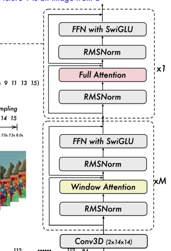

## Qwen2.5VL视觉编码器

#### 输入数据
* pixel_values: 
    ```text
    Tensor[[grid_t*grid_h*grid_w, 1176], bf16, cuda:0]
    ```
* image_grid_thw: 
    ```text
    image_grid_thw: [[grid_t, grid_h, grid_w]]
    Tensor[[1, 3], u32, cuda:0]
    ```

### PatchEmbed

[PatchEmbed](patch_embed.md)

### PositionEncode

[2D_RoPE](2d_rope.md)

### WindowAttention

[WindowAttention](window_attention.md)

### Vision Encode整体结构



1. 输入数据：(grid_t\*grid_h\*grid_w, 1176)
2. 经过patch embed: (grid_t\*grid_h\*grid_w, 1280)
3. attention block
    * block num: 32
    * hidden_size: 1280
    * intermediate_size: 3420
    * 旋转位置编码生成
    * window attention:[0..6, 8..14, 16..22, 24..30]
        * 输入数据索引重排列
        * 窗口attention_mask生成
    * full attention: [7, 15, 23, 31]
        * attention_mask全0矩阵
4. merge:
    * (grid_t\*grid_h\*grid_w, 1280) -> (grid_t\*grid_h\*grid_w/2/2, 1280*4)
    * linear1: (grid_t\*grid_h\*grid_w/2/2, 1280\*4)-(grid_t\*grid_h\*grid_w/2/2, 1280\*4)
    * linear2: (grid_t\*grid_h\*grid_w/2/2, 1280\*4)->(grid_t\*grid_h\*grid_w/2/2, 2048)
5. 恢复原来的索引

#### 输出数据
hidden_state: (grid_t\*grid_h\*grid_w/2/2, 2048)

* [rust代码地址](https://github.com/jhqxxx/learn_qwen2_5_vl/blob/main/src/qwen2_5_vl/vision_model.rs)