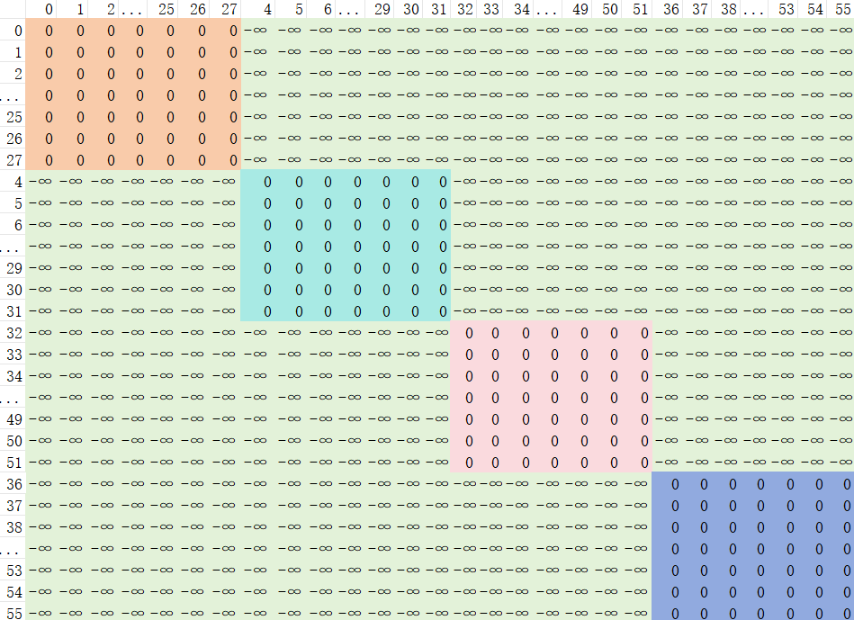

## Vision Emcode-WindowAttention

### 语言序列的窗口注意力
* q于k做矩阵乘得到注意力得分
* 注意力得分维度(bs, num_head, seq_len, seq_len)
* 基本因果注意力中，attention_mask是一个下三角矩阵，每个token能拥有它及它之前的所有token的注意力得分
* 窗口注意力，每个token能拥有它及它之前窗口大小个token的注意力得分

### 视觉序列的窗口注意力
* 视觉序列：(seq_len, hidden_dim)
* seq_len = grid_h*grdi_w
* window_size = 112
* merge_window_size = 112 / 2 / 14 = 4

* 示例数据：
    * num_token = 56，
    * 其中每个token考虑merge操作
    * 维度：(num_token, 4，hidden_dim)

* 划分窗口
    * h=7,不能整除merge_window_size，需要填充-100以满足窗口划分

* 视觉序列按窗口重排：[0，1，2，3，8，9，10，11，16，17，18，19，24，25，26，27，4，5，6，7，12，...52, 53, 54, 55]
* 旋转位置编码也要按相同索引重排
* 记录每个窗口中有效token的数量: [16, 16, 12, 12]
* 计算累计序列长度：[16, 32, 44, 56]
* 生成attention_mask: 

