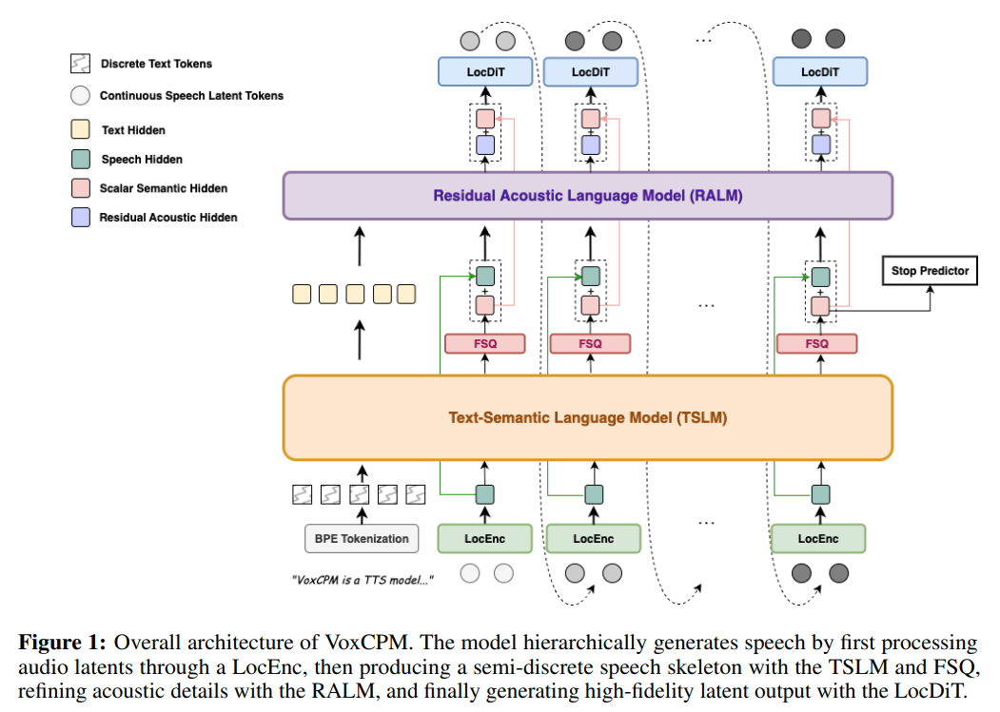

# VoxCPM的rust推理
#### 模型结构图



#### rust代码
代码地址：https://github.com/jhqxxx/aha/tree/main/src/models/voxcpm

#### 输入
* 目标文本
* 模板语音文件-可选
* 模板文字-可选

#### 输出
* 语音Tensor

## 模型推理详解
### preprocess
* 模板语音文件
    1. rust加载.wav
        * 使用hound库
        * int类型
            * 8/16/24位 -> -1.0~1.0 float
            * i8::Max/i16::Max/i24::Max
        * float类型
        * 多通道的对channel维度求平均，处理成单通道
    2. 重采样
        * 重采样为16kHz的数据
        * rust重写的torchaudio.functional.resample
    3. 得到音频Tensor，维度为: [channel, audio_len],channel=1

### Tokenizer+Embedding
* 使用BPE
* 中文字符级分割：
    * 将多字符token转换成单一字符token
    * "你好"-> "你","好"
    * 缓解陌生词汇的生成效果

### AudioVAE
* encoder
    * Conv1D
    * 下采样[2, 5, 8, 8]-> 640倍    
    * 16kHz压缩到25Hz的音频潜表征
    * in_channel: 1
    * middle_channel: 128->256->512->1024->2048
    * out_channel: 64
    * 计算均值和方差
    * 权重归一化：scaled_weight = (weight_v / ||weight_v||) * weight_g
    * 输出维度：[1, 64, n]
    
* audio: [1, 64, n] -> [n/2, 2, 64] 
* [text_len, 2, 64]全0矩阵 cat [n/2, 2, 64]
* 为了后续音频特征和文本特征融合加的占位符

* decoder
    * Conv1D，ConvTranspose1d
    * 上采样[8, 8, 5, 2]-> 640倍
    * in_channel: 64    
    * middle_channel: 1536->768->384->192->96
    * out_channel: 1
    * 25Hz->16kHz
    * tanh激活函数-> [-1.0, 1.0]

### MiniCPM4
* causal attention/full attention
* LongRoPE：对freqs进行缩放 

### LocEnc
* 输入：audio_feat: [b, t, 2, 64], b=1
* in_proj: [b, t, 2, 1024]
* cat special_tokens-> [b, t, 3, 1024]->[b*t, 3, 1024]
* MiniCPM：4 layers, 1024 hidden dim, 4096 FFN dim, full attention
* [b\*t, 3, 1024]dim1取第一条数据[b\*t, 1, 1024]
* 特殊令牌：
    * 训练得来的一组参数
    * 用于聚合整个序列的全局信息
    * 模型是full attention,所以这个token可以关注整个序列
    * 他的输出包含了整个序列的压缩信息
    * 减少计算和存储开销
* 音频特征输出：[b, t, 1024]

enc_to_lm_proj线性层, 使音频特征维度->文本特征维度,特征变换

text token经过嵌入得到text embedding

将text embedding和音频嵌入特征组合在一起

### Text-Semantic Language Model
* 捕捉高级语言结构
* 生成适合上下文的语音模式
* 通过处理文本标记和历史音频上下文，生成语义内容和韵律结构特征
* 输入：文本和音频嵌入的组合/生成的音频嵌入数据
* MiniCPM：24 layers (MiniCPM-4-0.5B initialized), 1024 hidden dim, 4096 FFN dim, causal attention

### FSQ
* 输入： TSLM的输出
* 两个线性层
* 量化操作：将连续隐藏状态投影到结构化格子上，以创建半离散表示
```rust
// scale = 9
let xs = xs.tanh()?; // [-1.0, 1.0]
let xs = xs
    .affine(self.scale as f64, 0.0)? // 放大9倍
    .round()? // 取整
    .affine(1.0 / self.scale as f64, 0.0)?;  // [-1.0, -8/9, ..., 8/9, 1]
```
* 创建了一个信息瓶颈，使模型更鲁棒
* 捕获粗略的语义-韵律骨架

TSLM+FSQ 路径专注于内容稳定性和韵律连贯性

### Residual Acoustic Language Model
* 输入：FSQ的输出 + 音频特征嵌入
* MiniCPM：6 layers, 1024 hidden dim, 4096 FFN dim, causal attention
* 为了恢复量化过程中衰减的细粒度声学信息
* 它处理量化残差以及上下文信息，以恢复说话人身份、频谱精细结构和微韵律变化。

RALM 路径则专注于声学表现力和说话者特征

lm_to_dit_proj,使TSLM文本特征维度->音频特征维度,特征变换

res_to_dit_proj,使RALM文本特征维度->音频特征维度,特征变换

### UnifiedCFM + LocDit
* 输入
    * FSQ的输出 + RALM的输出:[1, 1024]
    * 上一个时间步的音频信息:[1, 2, 64] -> [1, 64, 2]
    * 时间步数等参数
* 噪声估计模型：MiniCPM：4 layers, 1024 hidden dim, 4096 FFN dim, full attention
* 时间步embedding: SinusoidalPosEmb + TimestepEmbedding
* 双路径时间编码：时间步+步长(非均值模式下取0)
* 迭代输出：预测的音频潜变量：[1, 64, 2] -> [1, 2, 64] -> [1, 1, 2, 64]
* 多次输出在dim=1的维度上拼接：[1, n, 2, 64] -> [1, 64, n, 2] -> [1, 64, 2*n]

#### stop_predictor:
* 输入：FSQ的输出
* linear+silu+linear: out_dim=2, 0,1分类

### postprocess
* save_wav